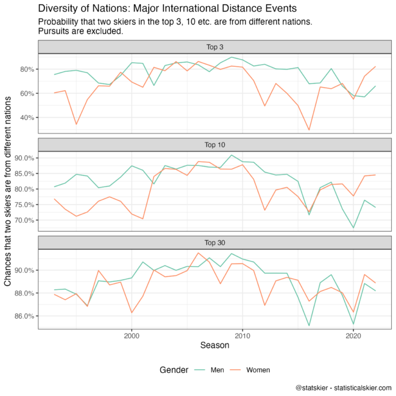

I thought it might be a decent time to revisit a thing I've done periodically, which is measure the diversity of nationalities among the top finishers. There are a ton of different diversity indexes, coming up mostly from either ecology (species diversity) or information theory (think Claude Shannon). I don't think I've been very consistent, but here we'll use the [Gini-Simpson](https://en.wikipedia.org/wiki/Diversity_index#Gini–Simpson_index) index since it has a convenient interpretation: the probability that two skiers chosen at random (with replacement) are from different nations. The higher the probability, the more 'diverse' the nationalities.

Here's a plot of this measure for major international distance events going back to the early 90's.

I want to draw your attention to the separate y-axis scales in each of the panels. This is important to keep in mind, to remember that despite the appearances of how "bouncy" the lines are, the variability in the Top 30 panel is much, much smaller.

The variability of the diversity for podium finishers (Top 3) is quite large, which we'd expect since it will be very responsive to dominant seasons by 1-2 individuals, like, say, Marit Bjoergen. The confirmation a lot of fans today should note is the general steady decline in diversity among the men since 2008 or so. The women's diversity at this level was also the highest in the 00's and then fell during the heyday of Bjoergen and Kowalczyk but has been climbing back up lately. A similar trend can be spotted at the Top 10 and (kind of) Top 30 levels, although the changes are happening at much smaller scales (again, keep the y-axis scales in mind).

Here's the same plot for sprints, going back to 2002 or so. This time I'm using the Top 12, to generally align with the semifinals.

Again, keep in mind the different scales on the y-axis. The Top 30 level is bouncing around much, much less than the others, despite how jagged the graph looks.

Not as much of an obvious overall trend here, except that the 2015 season seems to have marked a fairly dramatic transition from a period of relatively high nationality diversity in sprints to one dominated by Norway & Sweden that we're only sort of coming out of lately.
